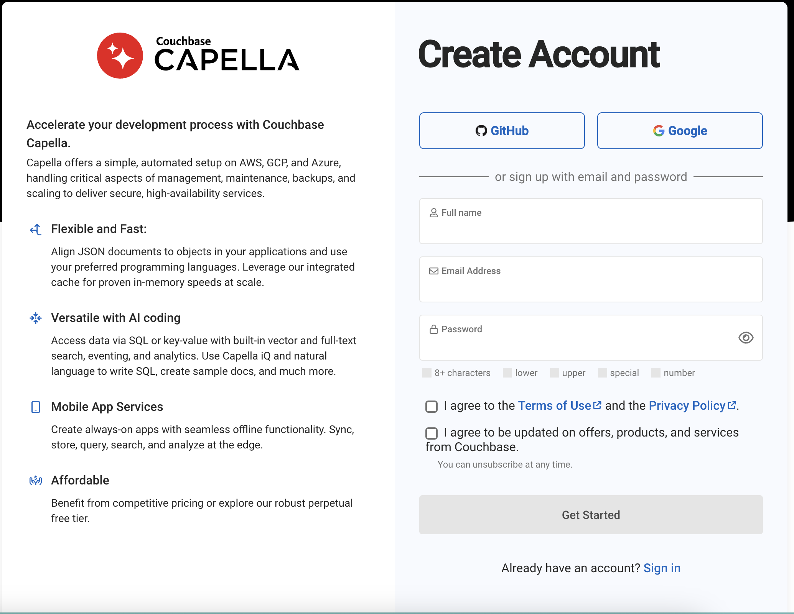
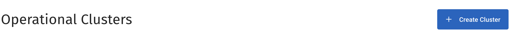
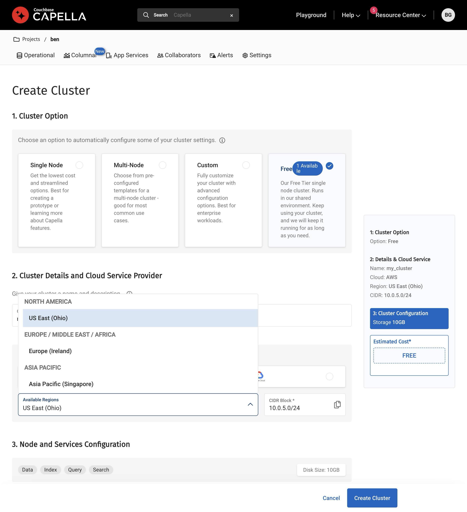
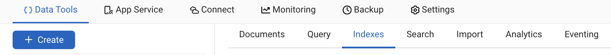
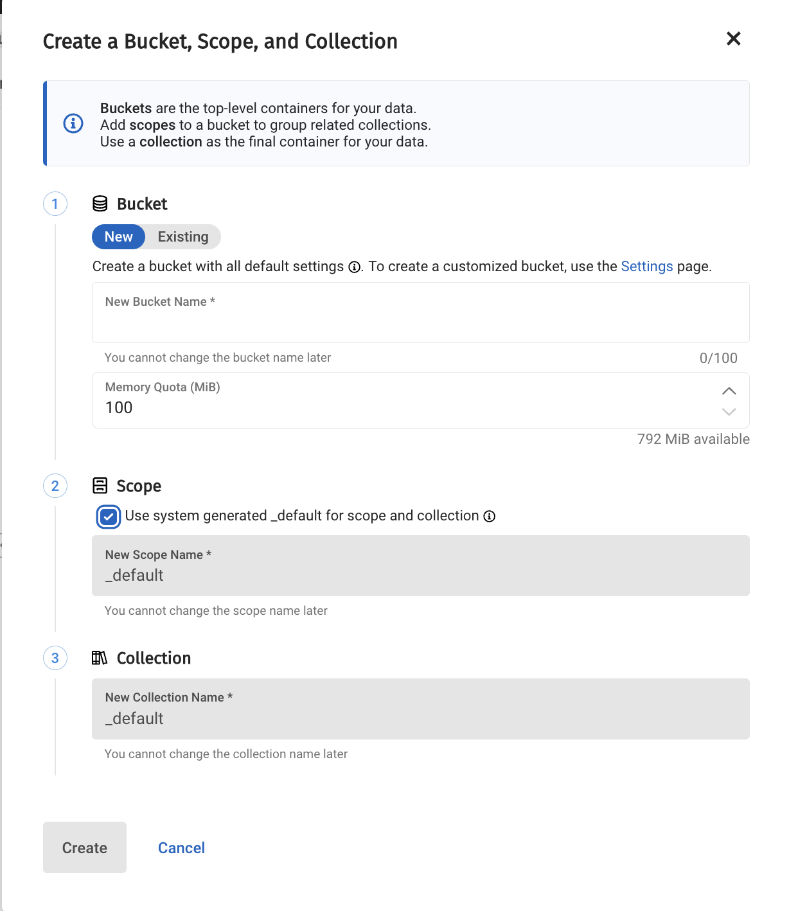
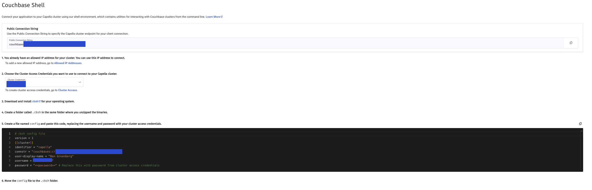

# Vector Search Workshop with Couchbase and Node.js


[](/LICENSE)

[](https://codespaces.new/hummusonrails/vector-search-nodejs-workshop)

This workshop is designed to help you get started with vector search using Couchbase and Node.js. We will be using the [Couchbase Node.js SDK](https://docs.couchbase.com/nodejs-sdk/current/hello-world/start-using-sdk.html) and [Couchbase Capella](https://www.couchbase.com/products/cloud) managed database service.

The entire workshop will be run from inside a GitHub Codespace, which is a cloud-based development environment that is pre-configured with all the necessary tools and services. You don't need to install anything on your local machine.

## Prerequisites

- A GitHub account
- A Couchbase Capella account

## Workshop Outline

1. [Create a Capella Account](#create-a-capella-account)
2. [Create a Couchbase Cluster](#create-a-couchbase-cluster)
3. [Create a Bucket](#create-a-bucket)
4. [Transform Data](#transform-data)
5. [Index Data](#index-data)
6. [Search Data](#search-data)

## Video Walkthrough

Want to give this a go but haven't had the chance to join an in-person or online Couchbase workshop yet? Follow along with this step-by-step guided video walkthrough of this workshop!

https://github.com/user-attachments/assets/ef5c71e6-17c0-44f5-b6f1-ecab3dd92789

## Create a Capella Account

Couchbase Capella is a fully managed database service that provides a seamless experience for developers to build modern applications. You can sign up for a free account at [https://cloud.couchbase.com/signup](https://cloud.couchbase.com/signup).



## Create a Couchbase Cluster

Once you have created an account, you can create a new Couchbase cluster by following the steps below:

1. Click on the "Create Cluster" button on the Capella dashboard.



2. Choose a cloud provider, name and region for your cluster and click on the "Create Cluster" button.



## Create a Bucket

After creating a cluster, you can create a new bucket by following the steps below:

1. Click on the "+ Create" button from inside the cluster dashboard.



2. Define the options for your bucket and click on the "Create" button.



## Transform Data

Before we can index and search data, we need to transform it into a format that can be used by the vector search engine. We will be using [Couchbase Vector Search](https://docs.couchbase.com/server/current/fts/fts-vector-search.html) for this workshop.

There are two options in this workshop to generate vector embeddings from data:

1. Use the `/embed` endpoint provided in this repository to transform the data. *You need an OpenAI API key to use this option.*
2. Import directly the data with *already generated embeddings* into the Couchbase bucket. You can use the data provided in the `./data/individual_items_with_embedding` directory.

### Using Local Embeddings vs OpenAI API

This workshop gives you the flexibility to choose between generating embeddings locally or using the OpenAI API.

- If you have pre-generated embeddings (provided in the repository), you can use the `useLocalEmbedding` flag to avoid using the OpenAI API.
- If you want to generate embeddings dynamically from the text, you need to provide your OpenAI API key and set the `useLocalEmbedding` flag to `false`.

#### Setting the `USE_LOCAL_EMBEDDING` Flag

In the `.env` file, set the `USE_LOCAL_EMBEDDING` flag to control the mode:

```bash
USE_LOCAL_EMBEDDING=true
```

* `true`: Use pre-generated embeddings (no OpenAI API key required).
* `false`: Use OpenAI API to generate embeddings (OpenAI API key required).

Make sure to set the `OPENAI_API_KEY` in the `.env` file if you set `USE_LOCAL_EMBEDDING` to `false`.

```bash
OPENAI_API_KEY=your_openai_api_key
```

Follow the instructions below for the option you choose.

### Option 1: Use the `/embed` Endpoint

Provided in this repository is an Express.js application that will expose a `/embed` endpoint to transform the data.

The Codespace environment already has all the dependencies installed. You can start the Express.js application by running the following command:

```bash
node server.js
```

The repository also has a sample set of data in the `./data/individual_items` directory. You can transform this data by making a `POST` request to the `/embed` endpoint providing the paths to the data files as an array in the request body.

```bash
curl -X POST http://localhost:3000/embed -H "Content-Type: application/json" -d '["./data/data1.json", "./data/data2.json"]'
```

The data has now been converted into vector embeddings and stored in the Couchbase bucket that you created earlier.

### Option 2: Import Data with Pre-Generated Embeddings

If you choose to import the data directly, you can use the data provided in the `./data/individual_items_with_embedding` directory. The data is already in the format required to enable vector search on it.

Once you have opened this repository in a [GitHub Codespace](https://codespaces.new/hummusonrails/vector-search-nodejs-workshop), you can import the data with the generated embeddings using the [Couchbase shell](https://couchbase.sh/docs/#_importing_data) from the command line.

#### Edit the Config File

First, edit the `./config_file/config` file with your Couchbase Capella information.

You can find a pre-filled config file in the Couchbase Capella dashboard under the "Connect" tab.

Once you click on the "Connect" tab, you will see a section called "Couchbase Shell" among the options on the left-hand menu. You can choose the access credentials for the shell and copy the config file content provided and paste it in the ./config_file/config file.



#### Import Data with Couchbase Shell

Change into the directory where the data files with embeddings are:

```bash
cd data/individual_items_with_embedding
```

Open up Couchbase shell passing in an argument with the location of the config file defining your Couchbase information:

```bash
cbsh --config-dir ../config-file
```

Once in the shell, run the `nodes` command to just perform a sanity check that you are connected to the correct cluster.

```bash
> nodes
```

This should output something similar to the following:

```bash
╭───┬───────────┬────────────────┬─────────┬──────────────────────────┬───────────────────────┬───────────────────────────┬──────────────┬─────────────┬─────────╮
│ # │  cluster  │    hostname    │ status  │         services         │        version        │            os             │ memory_total │ memory_free │ capella │
├───┼───────────┼────────────────┼─────────┼──────────────────────────┼───────────────────────┼───────────────────────────┼──────────────┼─────────────┼─────────┤
│ 0 │ dev.local │ 127.0.0.1:8091 │ healthy │ search,indexing,kv,query │ 8.0.0-1246-enterprise │ x86_64-apple-darwin19.6.0 │  34359738368 │ 12026126336 │ false   │
╰───┴───────────┴────────────────┴─────────┴──────────────────────────┴───────────────────────┴───────────────────────────┴──────────────┴─────────────┴─────────╯
```

Now, import the data into the bucket you created earlier:

```bash
ls *_with_embedding.json | each { |it| open $it.name | wrap content | insert id $in.content._default.name } | doc upsert
```

Once this is done, you can perform a sanity check to ensure the documents were inserted by running a query to select just one:

```bash
query "select * from name_of_your_bucket._default._default limit 1"
```

Replace the `name_of_your_bucket` with the name of your bucket you created.

## Index Data

Once the vector embeddings have been stored in the Couchbase bucket, we can create a vector search index to enable similarity search.

You will use Couchbase Shell to perform this action as well.

Run the following command from inside the shell:

```bash
vector create-index --bucket name_of_your_bucket --similarity-metric dot_product vector-search-index embedding 1536
```

Replace the `name_of_your_bucket` with the name of your bucket you created.

You can perform a santity check to ensure the index was created by querying for all the indexes and you should see the `vector_search_index` in the list:

```bash
query indexes
```

## Search Data

Now that the data has been indexed, you can perform similarity searches using the vector search index.

You can use the `/search` endpoint provided in this repository to search for similar items based on a query item. The endpoint will return the top 5 most similar items.

The Codespace environment already has all the dependencies installed. You can start the Express.js application by running the following command:

```bash
node server.js
```

Once the server is running, you can either search using the provided query with the embedding already generated or you can provide your own query item.

### Search with the provided query

You can search for similar items based on the provided query item by making a `POST` request to the `/search` endpoint.

Here is an example `cURL` command to search for similar items based on the provided query item:

```bash
curl -X POST http://localhost:3000/search \
  -H "Content-Type: application/json" \
  -d '{"q": "", "useLocalEmbedding": true}'
```

As you can see, we use the `useLocalEmbedding` flag to indicate that we want to use the provided query item and we keep the `q` field empty.

### Search with your own query

If you want to search for similar items based on your own query item, you can provide the query item in the request body.

The query will be automatically converted into a vector embedding using the OpenAI API. You need to provide your OpenAI API key in the `.env file` before starting the Express.js application.

Here is an example cURL command to search for similar items based on your own query item:

```bash
curl -X POST http://localhost:3000/search \
  -H "Content-Type: application/json" \
  -d '{"q": "your_query_item"}'
```

